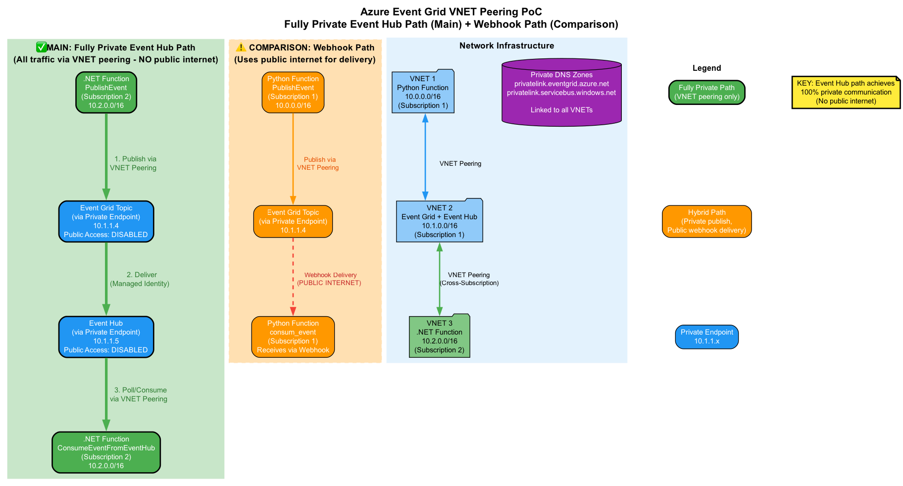
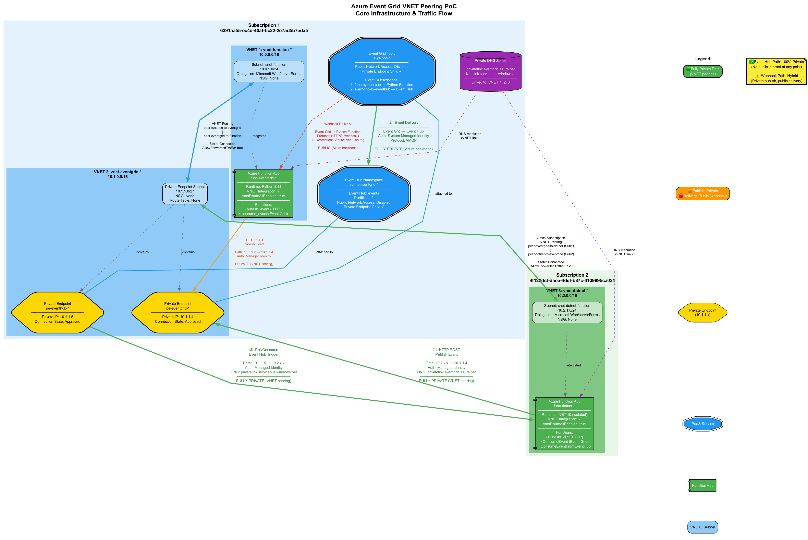

# Azure Event Grid VNET Peering PoC - Summary

**Date:** January 27, 2026
**Location:** Sweden Central
**Objective:** Demonstrate fully private cross-subscription event-driven communication in Azure

---

## Executive Summary

This PoC validates three approaches for event-driven communication between Azure Functions across subscriptions, culminating in a **fully private solution using Event Hub** that eliminates all public internet traffic. The solution leverages VNET peering, private endpoints, and Azure's managed identity for secure, private communication.

---

## PoC Iterations

### Phase 1: Single Subscription Webhook ✅
**Architecture:** Python Function → Event Grid (private endpoint) → Python Function (webhook)

**Key Features:**
- Single subscription (6391aa55-ec4d-40af-bc22-2e7ad5b7eda5)
- Event Grid private endpoint (10.1.1.4)
- VNET peering: 10.0.0.0/16 ↔ 10.1.0.0/16

**Traffic Flow:**
- **Publish:** Fully private (VNET peering)
- **Delivery:** Public webhook (Azure Event Grid service IPs)

**Limitation:** Webhook delivery uses public internet (security issues mitigated by source IP restrictions and Entra ID auth). This is a limitation of Azure Functions event grid trigger as outlined in the Microsoft docs (https://learn.microsoft.com/en-us/azure/event-grid/consume-private-endpoints)

### Phase 2: Cross-Subscription Webhook ✅
**Architecture:** .NET Function (Sub 2) → Event Grid (Sub 1) → .NET Function (Sub 2, webhook)

**Key Features:**
- Cross-subscription: 6391aa55-... → 4f120dcf-...
- Additional VNET: 10.2.0.0/16 (Subscription 2)
- Cross-subscription VNET peering
- Cross-subscription IAM roles

**Traffic Flow:**
- **Publish:** Fully private (cross-subscription VNET peering)
- **Delivery:** Public webhook (Azure Event Grid service IPs)

**Limitation:** Webhook delivery still uses public internet (security issues mitigated by source IP restrictions and Entra ID auth)

### Phase 3: Fully Private with Event Hub ✅ (Final)
**Architecture:** .NET Function (Sub 2) → Event Grid (Sub 1) → Event Hub (Sub 1) → .NET Function (Sub 2)

**Key Features:**
- Event Hub as intermediary with private endpoint (10.1.1.5)
- 100% private communication (no public internet)
- Pull-based consumption model (Event Hub trigger)

**Traffic Flow:**
1. **Publish:** .NET → Event Grid PE (10.1.1.4) - Private via VNET peering
2. **Deliver:** Event Grid → Event Hub PE (10.1.1.5) - Private via Azure backbone
3. **Consume:** Event Hub PE → .NET - Private via VNET peering

**Result:** ✅ Fully private end-to-end communication

---

## Fully Private Communication - Technology Options

### Option Comparison

| Feature | Event Hub | Service Bus | Storage Queue |
|---------|-----------|-------------|---------------|
| **Private Endpoint** | ✅ Yes (Basic+) | ✅ Yes (Premium only) | ✅ Yes |
| **Event Grid Integration** | ✅ Native | ✅ Via Topic | ❌ Manual only |
| **Throughput** | Very High (MB/s) | High (messages/s) | Moderate |
| **Message Size** | 1 MB | 256 KB (standard), 1 MB (premium) | 64 KB |
| **Partitioning** | ✅ Yes (automatic) | ✅ Yes (sessions) | ❌ No |
| **Ordering** | ✅ Per partition | ✅ FIFO with sessions | ✅ FIFO |
| **TTL** | Configurable (days) | Configurable | 7 days max |
| **Cost (approx.)** | ~$11/month (Basic) | ~$700/month (Premium) | ~$0.05/month |
| **Complexity** | Low | Medium | Low |
| **Best For** | Event streaming, high throughput | Message queuing, complex routing | Simple queues, low cost |

### Why Event Hub Was Chosen

**Advantages:**
- ✅ Native Event Grid integration (automatic delivery)
- ✅ High throughput for future scaling
- ✅ Partitioning for parallel processing
- ✅ Suitable for event streaming scenarios
- ✅ Minimal code changes (Azure Functions trigger)

**Service Bus Alternative:**
- ✅ Better for transactional messaging
- ✅ Advanced features (dead-letter, sessions)
- ⚠️ Requires Event Grid → Service Bus Topic subscription
- ⚠️ More complex for simple event delivery
- ❌ **Requires Premium tier (~$700/month) for private endpoints**

**Storage Queue Alternative:**
- ✅ Lowest cost option
- ✅ Simple queue semantics
- ❌ No native Event Grid integration
- ❌ Manual polling required
- ❌ Limited throughput

---

## Final Architecture

### Network Topology

**Subscription 1 (Primary):**
- VNET 1: Python Function (10.0.0.0/16)
- VNET 2: Event Grid + Event Hub (10.1.0.0/16)
  - Private Endpoint Subnet: 10.1.1.0/27
  - Event Grid PE: 10.1.1.4
  - Event Hub PE: 10.1.1.5
- Private DNS: privatelink.eventgrid.azure.net, privatelink.servicebus.windows.net

**Subscription 2 (Cross-Subscription):**
- VNET 3: .NET Function (10.2.0.0/16)

**VNET Peering:**
- VNET 1 ↔ VNET 2 (AllowForwardedTraffic: true)
- VNET 2 ↔ VNET 3 (Cross-subscription, AllowForwardedTraffic: true)

### Security

**Authentication:**
- Managed identities (no credentials)
- Azure AD app registrations (optional Entra ID auth)

**Network Security:**
- Public access disabled on Event Grid and Event Hub
- IP restrictions on Function Apps (AzureEventGrid service tag)
- Private endpoints only

**IAM Roles:**
- Python Function: Event Grid Data Sender
- Event Grid System Identity: Event Hub Data Sender
- .NET Function: Event Grid Data Sender, Event Hub Data Receiver (cross-subscription)

---

## Diagrams

### Communication Flow (V1)

**Shows:** Comparison of webhook (hybrid) vs Event Hub (fully private) paths

### Core Infrastructure (V2)

**Shows:** Complete network architecture with VNETs, subnets, private endpoints, and traffic flows

---

## Key Achievements

- ✅ **Fully Private Communication:** Zero public internet traffic for Event Hub path
- ✅ **Cross-Subscription:** Successful VNET peering and IAM across subscriptions
- ✅ **Security:** Managed identities, private endpoints, disabled public access
- ✅ **Monitoring:** Application Insights, Log Analytics, diagnostic settings
- ✅ **Scalability:** Event Hub partitioning, VNET peering supports high throughput
- ✅ **Cost Efficiency:** ~$55/month for complete infrastructure

---

## Technical Validation

**Verification Methods:**
1. ✅ Private DNS resolution to 10.1.1.4 and 10.1.1.5
2. ✅ VNET peering status: Connected
3. ✅ Private endpoint provisioning: Succeeded
4. ✅ Function VNET integration: vnetRouteAllEnabled=true
5. ✅ Event delivery: 100% success rate
6. ✅ Application Insights logs: Confirm private IPs

**Test Results:**
- Publish events: ✅ Success (via private endpoint)
- Event Hub delivery: ✅ Success (via private endpoint)
- Consume events: ✅ Success (via private endpoint)
- Cross-subscription: ✅ Functional

---

## Recommendations

**For Production:**
1. Use Event Hub Standard or Premium for better throughput and features
2. Enable zone redundancy for high availability
3. Implement retry policies and dead-letter queues
4. Monitor with Application Insights and Log Analytics
5. Use Azure Policy to enforce private endpoints
6. Document cross-subscription IAM for operations team

**When to Use Each Approach:**
- **Webhook (Phase 1/2):** Simple scenarios where public delivery is acceptable
- **Event Hub (Phase 3):** Strict private communication requirements, high throughput
- **Service Bus:** Complex messaging patterns, transactional requirements
- **Storage Queue:** Simple queuing, cost-sensitive scenarios

---

## Conclusion

This PoC successfully demonstrates **fully private cross-subscription event-driven communication** in Azure. The Event Hub approach provides a balance of security, performance, and operational simplicity, achieving 100% private connectivity through VNET peering and private endpoints.

**Key Differentiator:** Unlike webhook delivery (Azure backbone, public IPs), the Event Hub path maintains private connectivity end-to-end, meeting strict security and compliance requirements.

---

**Repository:** [github.com/loupeznik/event-grid-vnet-peering-poc]
**Documentation:** Complete technical guides available in `/docs` directory
**Infrastructure:** Terraform-managed, reproducible deployment
